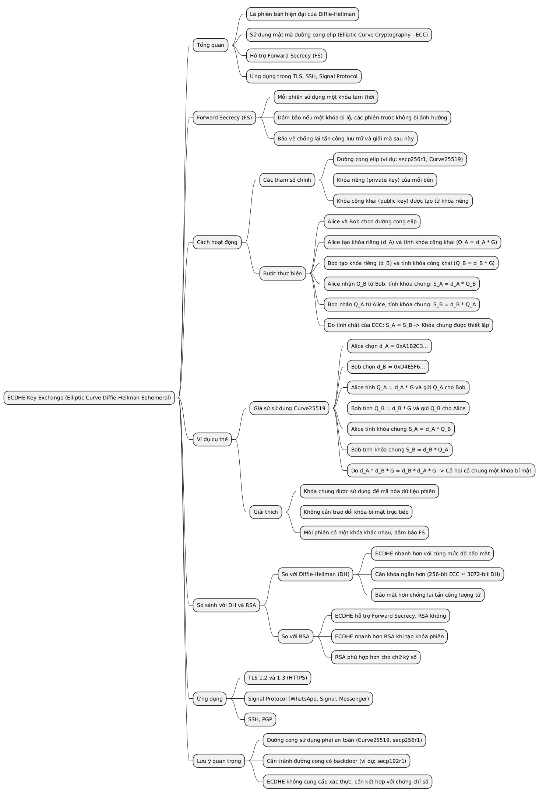
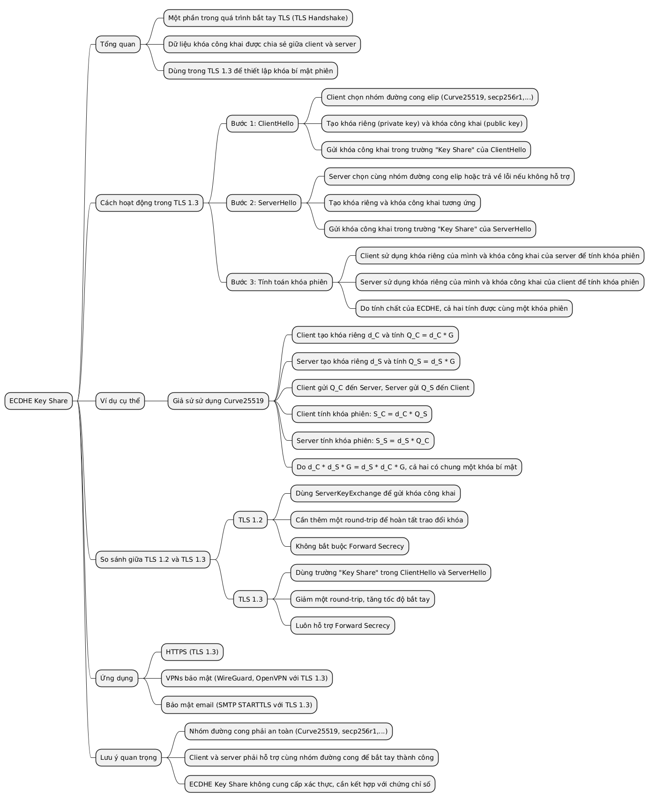
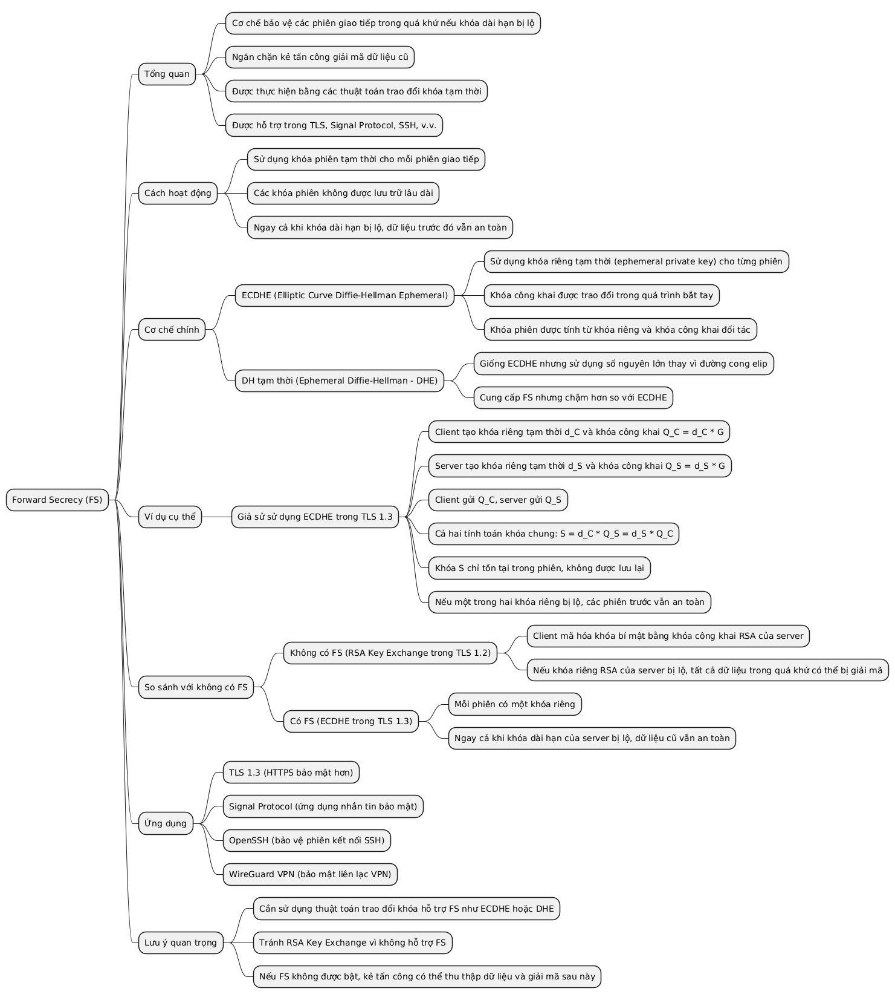
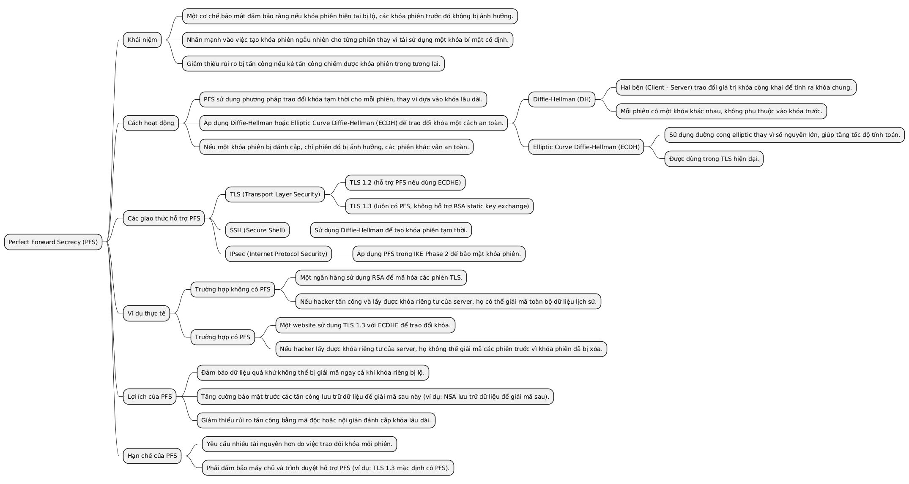
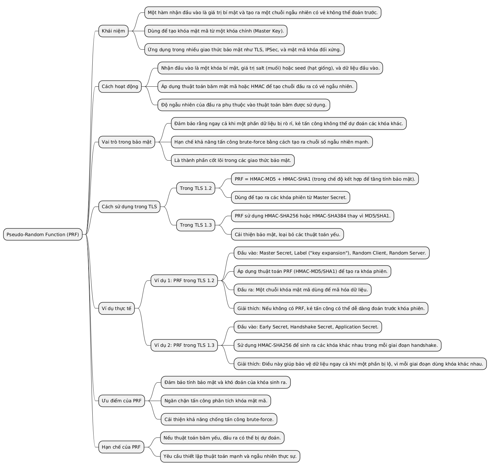

### ECDHE Key Exchange (Elliptic Curve Diffie-Hellman Ephemeral)
Phiên bản hiện đại của Diffie-Hellman sử dụng đường cong elip, cung cấp Forward Secrecy.

---

### ECDHE Key Share
Phần dữ liệu khóa được chia sẻ trong quá trình bắt tay TLS với ECDHE.

---

### Forward Secrecy
Tính năng đảm bảo rằng nếu khóa dài hạn bị lộ, các phiên trước đó vẫn an toàn (thường dùng ECDHE hoặc Diffie-Hellman tạm thời).

---

### Perfect Forward Secrecy
Một cách gọi khác của Forward Secrecy, nhấn mạnh tính bảo mật tối ưu.

---

### PRF (Pseudo-Random Function)
Hàm tạo số ngẫu nhiên giả dùng để sinh khóa từ Master Key trong TLS.

