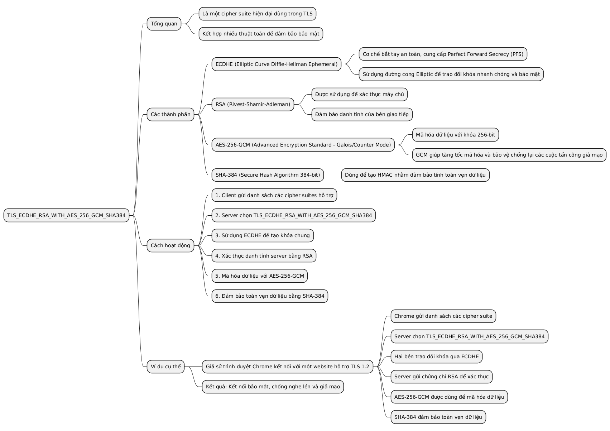
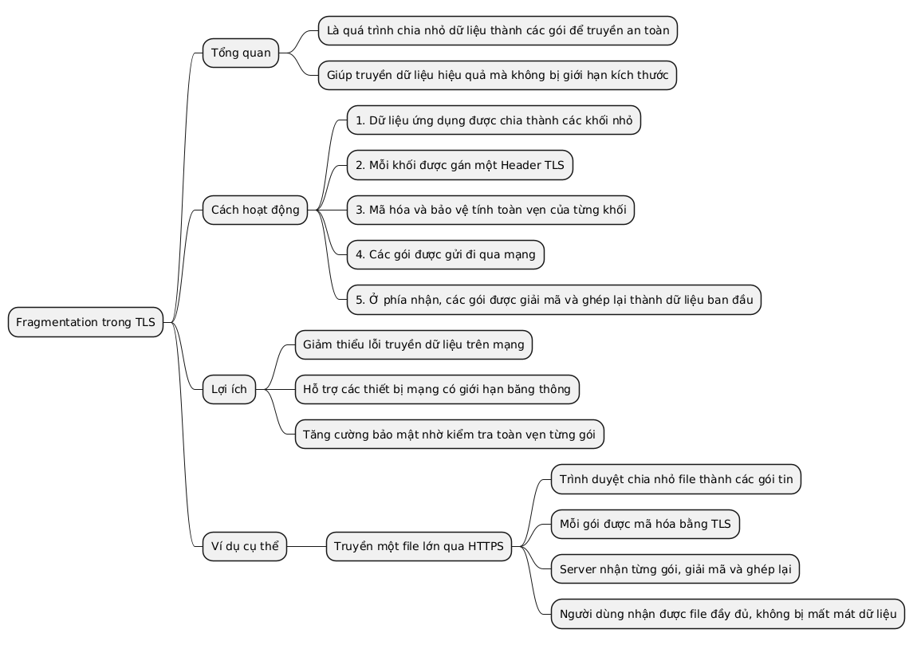
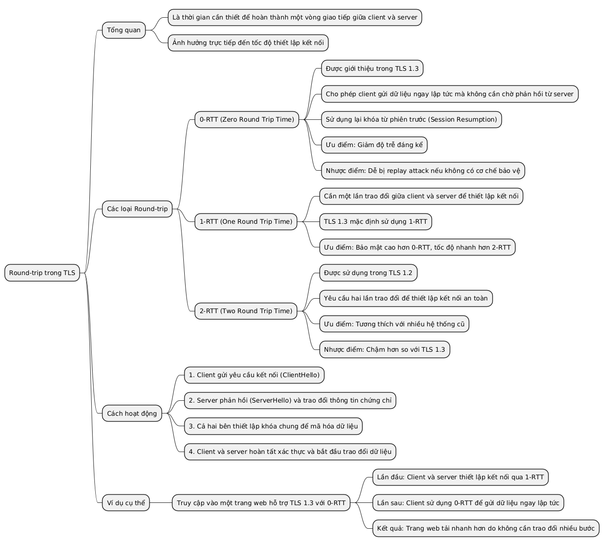
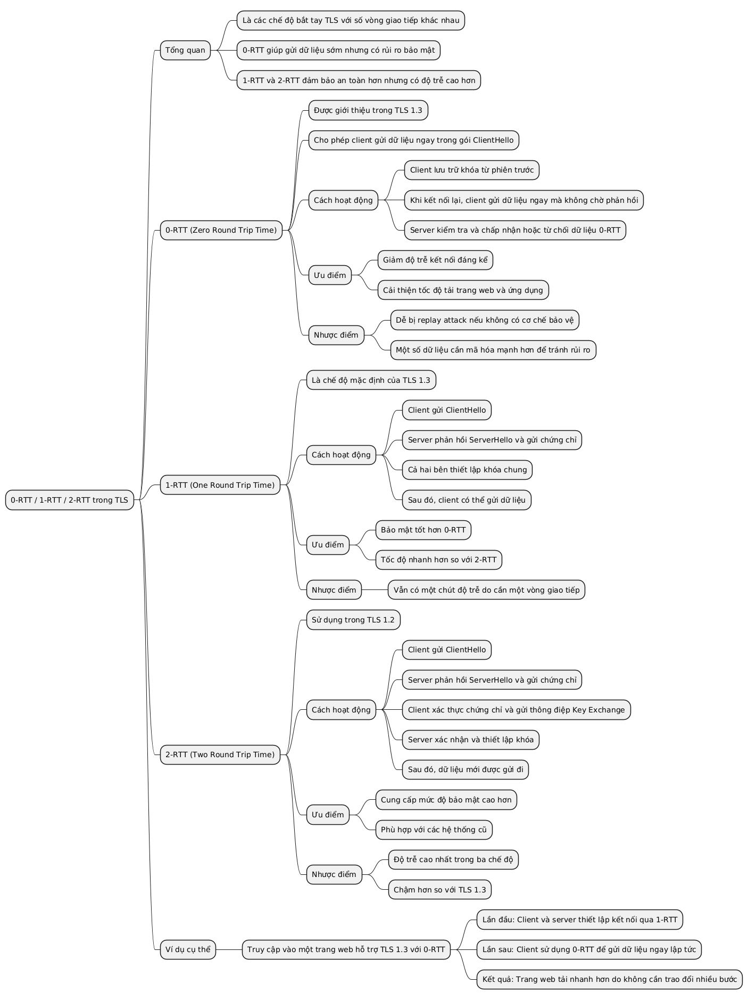
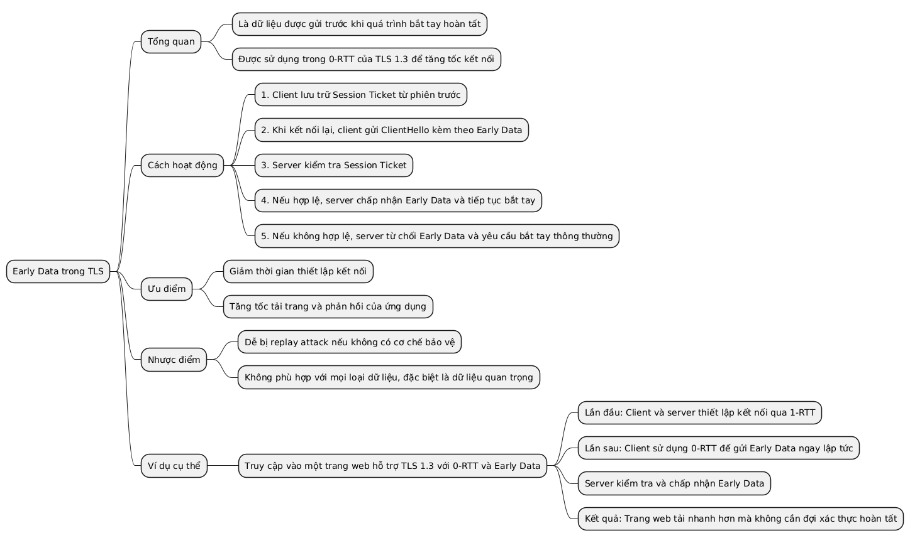

### TLS_ECDHE_RSA_WITH_AES_256_GCM_SHA384
Một cipher suite hiện đại kết hợp ECDHE, RSA, AES-256-GCM và SHA-384.

---

### Fragmentation
Chia nhỏ dữ liệu thành các gói để truyền trong TLS.

---

### Round-trip
Thời gian một vòng giao tiếp giữa client và server (0-RTT, 1-RTT, 2-RTT).

---

### 0-RTT / 1-RTT / 2-RTT
Các chế độ bắt tay TLS với số vòng giao tiếp khác nhau; 0-RTT cho phép gửi dữ liệu sớm nhưng ít an toàn hơn.

---

### Early Data
Dữ liệu được gửi trước khi quá trình bắt tay hoàn tất trong 0-RTT.

