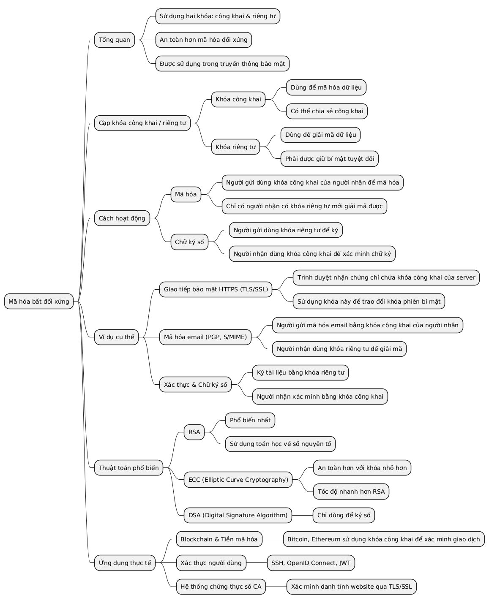
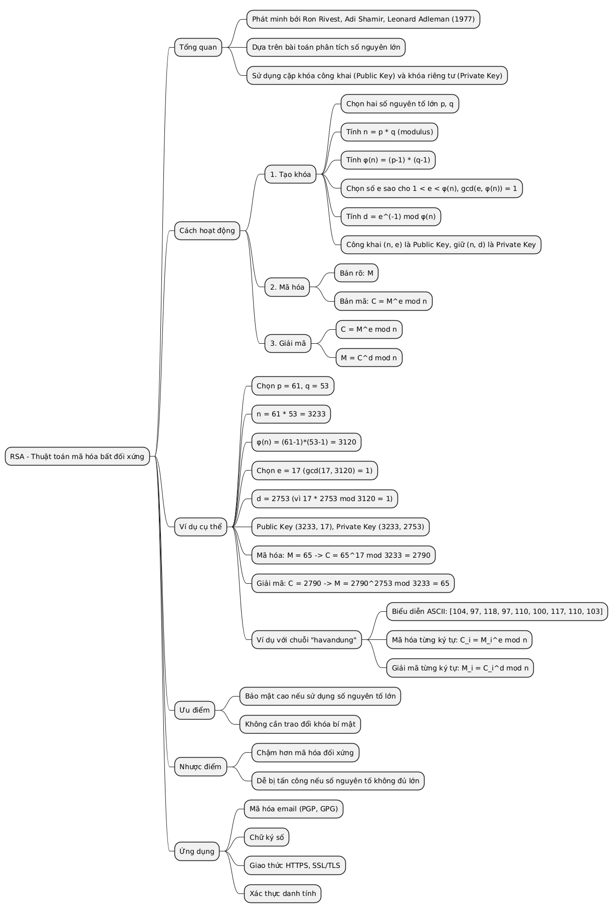
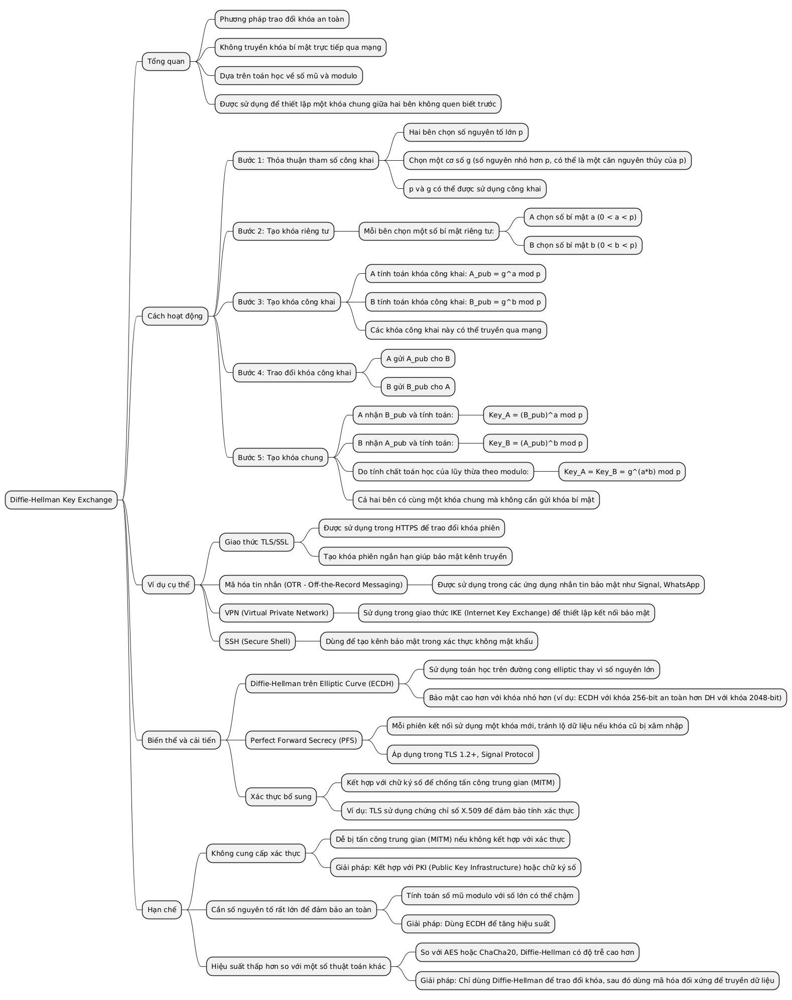
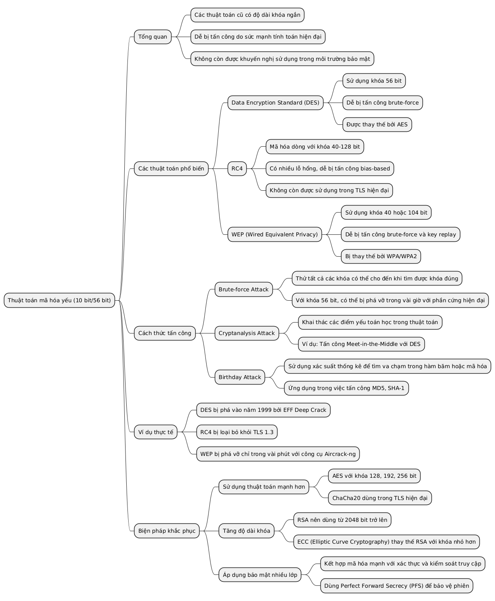
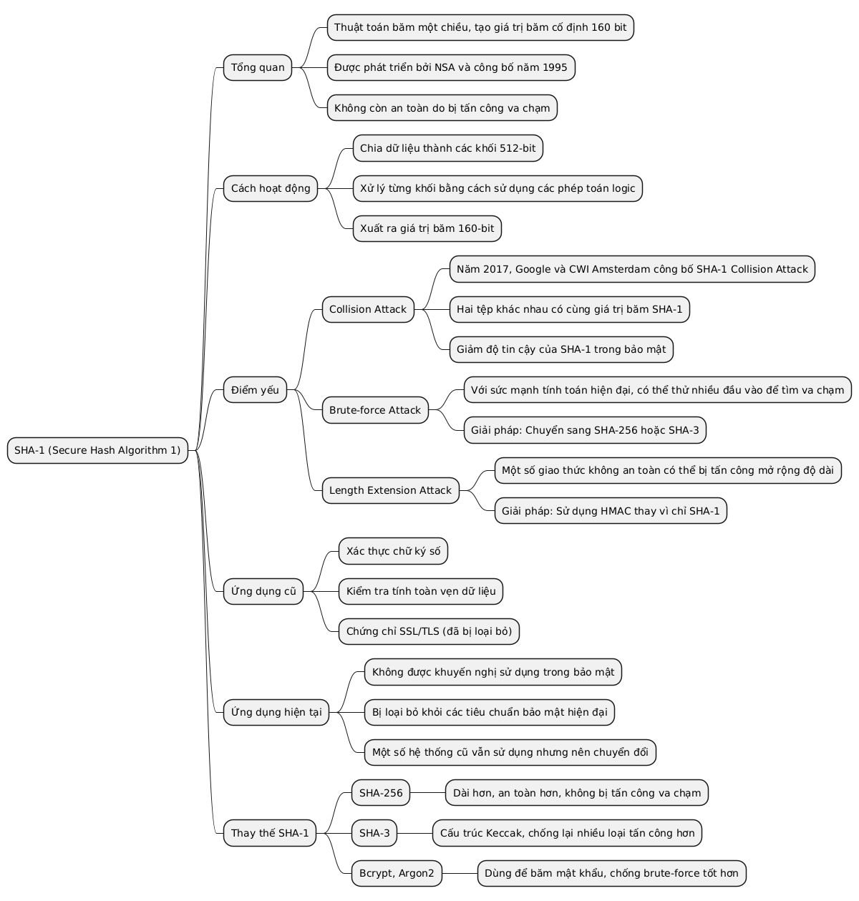
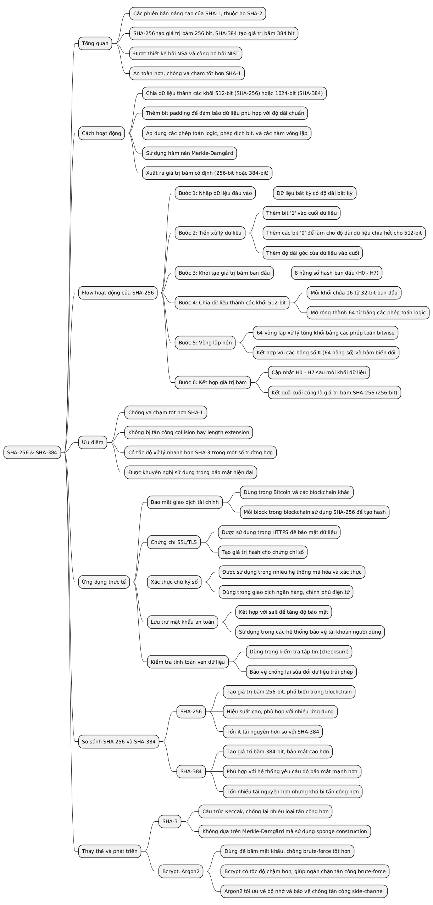
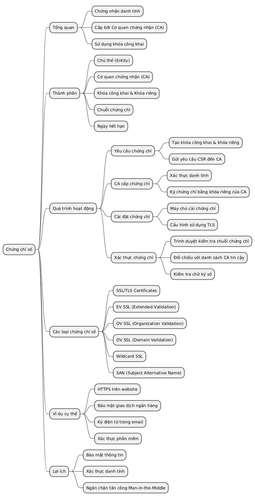

# Khái niệm cơ bản về mã hóa và bảo mật

## Khóa công khai / Khóa riêng tư
Cặp khóa cơ bản trong mã hóa bất đối xứng:
- **Khóa công khai**: Được sử dụng để mã hóa dữ liệu.
- **Khóa riêng tư**: Được sử dụng để giải mã dữ liệu (hoặc ngược lại trong chữ ký số).

---

## RSA (Rivest-Shamir-Adleman)
Thuật toán mã hóa bất đối xứng phổ biến, sử dụng cặp khóa công khai và riêng tư để đảm bảo bảo mật dữ liệu.

---

## Diffie-Hellman
Phương pháp trao đổi khóa giúp hai bên tạo ra một khóa bí mật chung mà không cần gửi trực tiếp khóa qua mạng.

---

## Thuật toán mã hóa yếu
- **10-bit / 56-bit encryption**: Các thuật toán cũ với độ dài khóa ngắn, dễ bị tấn công do sức mạnh tính toán hiện đại.

---

## Thuật toán hash
Hàm băm tạo ra giá trị băm cố định từ dữ liệu để kiểm tra tính toàn vẹn.

---

### SHA-1
- Thuật toán hash cũ.
- Không còn an toàn do dễ bị tấn công va chạm.

---

### SHA-256 / SHA-384
- Phiên bản hash mạnh hơn, an toàn hơn SHA-1.

---

## MAC (Message Authentication Code)
Mã xác thực thông điệp, dùng để đảm bảo tính toàn vẹn và xác thực dữ liệu.

.png)

---

## Chứng chỉ số
- Chứng nhận danh tính của một thực thể (như website).
- Được cấp bởi cơ quan chứng nhận (CA), sử dụng khóa công khai để xác thực.

